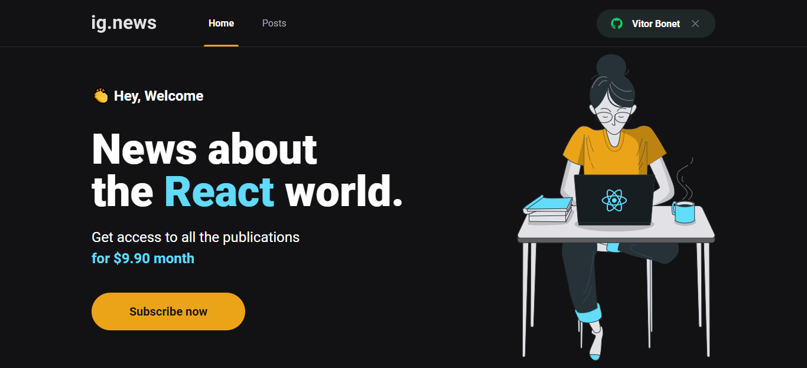
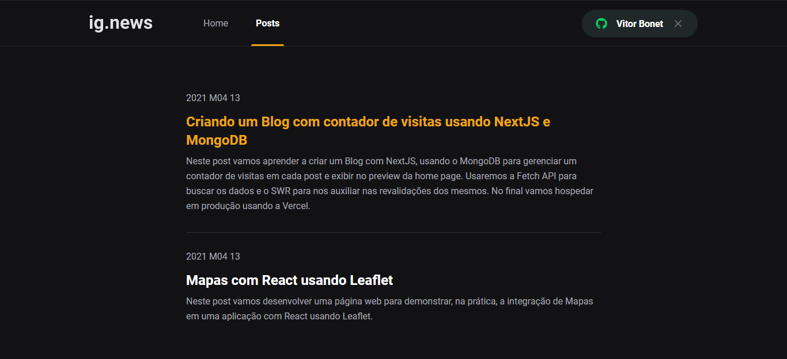
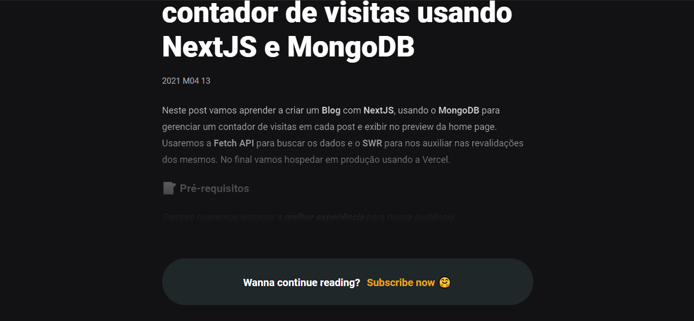

# GoBarber

<h1>
  
  
  
</h1>

## Indice

  - [Sobre](#-sobre)
  - [Tecnologias](#-tecnologias)
  - [Como baixar o projeto](#-como-baixar-o-projeto)

---

### 📜 Sobre

  **Ignews** é uma aplicação para testar os ferramentas do Next.js, um pequeno blog que usa conexão com banco FaunaDB, ferramenta de pagamentos stripe e o CMS Prismic. Desenvolvido no curso Bootcamp Ignite da [Rocketseat](http://rocketseat.com.br/)

---

  ### 💻 Tecnologias

  - [React JS](https://pt-br.reactjs.org/)
  - [Next JS](https://nextjs.org/)
  - [Fauna DB](https://fauna.com/)
  - [Stripe](https://stripe.com/en-br)'
  - [Prismic](https://prismic.io/)
---

  ### 🖨 Como baixar o projeto

  ```bash

    # Clonar o repositório
    $ git clone https://github.com/VitorBonet/github_explorer.git

    #Entrar no diretório
    $ cd github_explorer

    # Intalar as dependências
    $ yarn install


    # Iniciar o projeto
    $ yarn start
  ```
---

Desenvolvido por Vitor Bonet 🏄‍♂️
